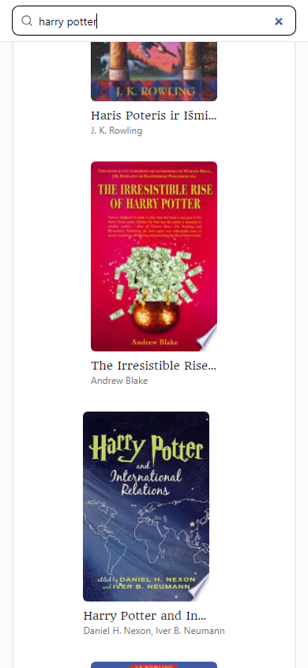
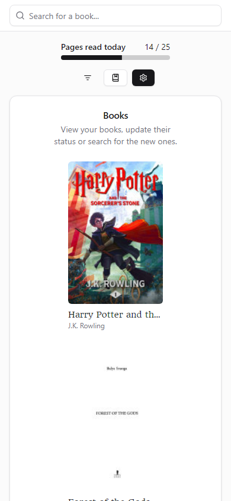
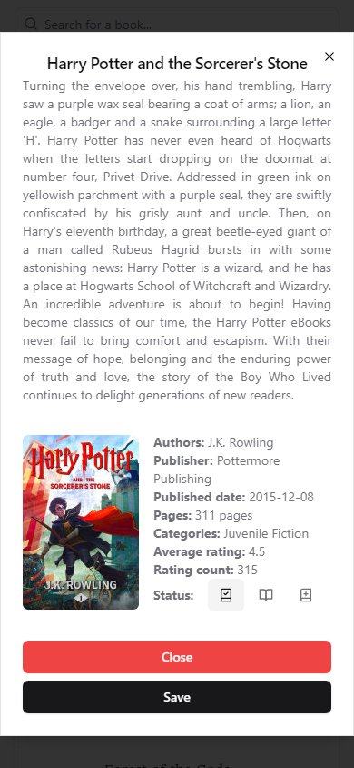
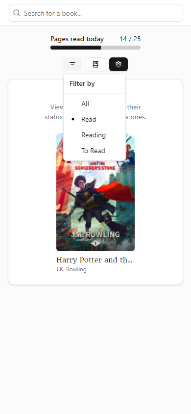

# literacite

If you enjoy reading books - search for and add them to your collection to track your progress. Change the status of your books and mark the number of pages you read daily.

- [Overview](#overview)
  - [Features](#features)
  - [Technologies and Tools](#technologies-and-tools)
  - [Screenshots](#screenshots)
- [Setup the Development Environment](#setup-the-development-environment)
  - [Install the required dependencies](#install-the-required-dependencies)
  - [Compile and Hot-Reload for Development](#compile-and-hot-reload-for-development)
  - [Run Unit Tests](#run-unit-tests)
  - [Run E2E Tests](#run-e2e-tests)
  - [Lint and format](#lint-and-format)

## Overview

### Features

- **Book Search**: user is able to search for books using Google Books API.
- **Add Book To Collection**: user is able to add a searched book to its collection.
- **Change Book Status**: user is able to change a book status (read, reading, to read).
- **Mark Pages Read**: user is able to mark how many pages were read in a current day.
- **Pages Per Day To Read**: user is able to change a setting for how many pages to read in a day.
- **Filter Books**: user is able to filter its collection's books by status.
- **Responsive Design**: ensuring a seamless user experience across all devices.

### Technologies and Tools

- 🖼️ **Framework**: [Vue](https://vuejs.org) with [TypeScript](https://www.typescriptlang.org)
- 😎 **Styling**: [Tailwind CSS](https://tailwindcss.com), [shadcn-vue](https://www.shadcn-vue.com), [lucide-vue-next](https://lucide.dev/guide/packages/lucide-vue-next)
- 🍍 **State Management**: [Pinia](https://pinia.vuejs.org)
- ✨ **Code Quality**: [ESLint](https://eslint.org), [Prettier](https://prettier.io), [Stylelint](https://stylelint.io)
- 🧐 **Testing**: [Vitest](https://vitest.dev), [Playwright](https://playwright.dev)
- 🏗️ **Build Tool**: [Vite](https://vitejs.dev)

### Screenshots







## Setup the Development Environment

### Install the required dependencies

```sh
npm install
```

### Compile and Hot-Reload for Development

```sh
npm run dev
```

### Run Unit Tests

```sh
npm run test:unit
```

### Run E2E Tests

```sh
npm run test:e2e
```

### Lint and format

```sh
npm run lint
```

```sh
npm run format
```
